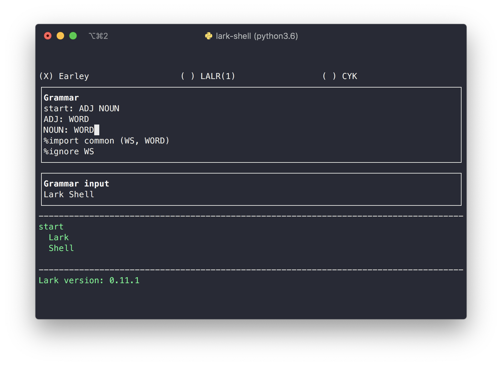

# Lark-shell
<!-- TOC depthFrom:1 depthTo:6 withLinks:1 updateOnSave:1 orderedList:0 -->

- [Lark-shell](#lark-shell)
	- [Background](#background)
	- [How to use](#how-to-use)
		- [Demonstration](#demonstration)
	- [Credits](#credits)

<!-- /TOC -->


<p align="center">
    <a href="https://saythanks.io/to/bryan.hu.2020@gmail.com">
        
    </a>
    <a href="https://github.com/psf/black">
        
    </a>
    <a href="https://gitmoji.carloscuesta.me">
        
    </a>
</p>

A terminal version of the [online Lark IDE][1].

## Background

I love using the online IDE for playing with Lark (and experimenting with grammars) but <!--it's really minimal
and -->it's not offline. So I decided to bring those features right into my terminal.

## Installation

Install it via [pip][4]:

```bash
$ python3 -m pip install lark-shell
✨🍰✨
```
or via [pipx][5]

```bash
$ pipx install lark-shell
✨🍰✨
```

If you want to contribute, see the [contributing guide](./CONTRIBUTING.md)

## How to use

If you installed the package correctly, you can just run

```bash
$ lark_shell
```

and start hacking away!

### Demonstration


This screencast of my [epic][8] [terminal][7] and [shell][6] is made with [asciinema][4] and [svg-term-cli][5].

## Credits

Credits to [**@erezsh**][2] for his wonderful [Lark][3] parsing library.


[1]: https://lark-parser.github.io/lark/ide/app.html
[2]: https://github.com/erezsh
[3]: https://github.com/lark-parser/lark
[4]: https://github.com/asciinema/asciinema
[5]: https://github.com/marionebl/svg-term-cli
[6]: https://github.com/ohmyzsh/ohmyzsh/
[7]: https://iterm2.com/
[8]: https://www.dictionary.com/browse/epic "troll"
